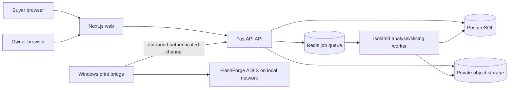

# `xxx` Architecture

## Architecture goals

Keep public web traffic, untrusted model processing, payment claims, and the physical printer in separate trust zones. Produce deterministic estimates and immutable quotation snapshots. Make every business-critical transition auditable and retry-safe. Preserve a manual operational path when hardware automation is unavailable.

## System view



## Repository shape

```text
apps/
  web/                 Next.js buyer and owner interfaces
services/
  api/                 FastAPI application and database migrations
  worker/              isolated model analysis, preview, and slicing jobs
  print-bridge/        Windows bridge and printer adapters
packages/
  contracts/           generated/shared API schemas where practical
infra/                 local containers and deployment configuration
docs/                  product, architecture, security, and operations
```

Do not share ORM models directly with the frontend. The API owns public schemas and publishes an OpenAPI contract. Generate frontend types from the reviewed contract after endpoints stabilize.

## Component responsibilities

### Next.js web

- Public service and policy pages.
- Buyer authentication, uploads, quote/order/payment status, and fulfillment tracking.
- Owner-only operational console.
- No pricing authority, payment verification, queue transition, or printer command originates from client state.

### FastAPI API

- Authentication, JWT lifecycle, authorization, CSRF controls, and owner MFA.
- Buyer, model, quotation, payment, order, queue, fulfillment, bridge, and audit APIs.
- State-machine enforcement, idempotency, rate limiting, signed upload/download coordination, and notification intents.
- No CPU-heavy model parsing or slicing in request handlers.

### PostgreSQL

Primary system of record. Suggested initial entities:

- `users`, `credentials`, `refresh_sessions`, `email_verifications`, `mfa_methods`
- `addresses`, `quote_requests`, `model_assets`, `analysis_runs`, `print_profiles`
- `materials`, `material_rates`, `pricing_policies`, `quotes`, `quote_line_items`
- `orders`, `payments`, `payment_evidence`, `print_jobs`, `job_events`
- `printers`, `bridge_installations`, `bridge_heartbeats`, `fulfillments`
- `audit_events`, `outbox_events`, `notifications`

Use UUID/ULID public identifiers, UTC timestamps, integer paise for money, integer or fixed-precision units for grams/minutes, optimistic version columns for contested owner actions, and database constraints for uniqueness/invariants.

### Redis-backed worker queue

- Virus/malware scan orchestration.
- Model metadata extraction and bounded rendering.
- Slicer execution with strict resource/time limits.
- Estimate calculation from a versioned pricing policy.
- Email delivery and retryable operational notifications.
- Transactional outbox consumption.

Jobs are idempotent and keyed by immutable input hashes plus analysis/profile versions.

### Private object storage

Store original models, sanitized derivatives, previews, sliced artifacts, and optional payment evidence under separate prefixes/buckets. Default private, encrypted, versioned where supported, and accessed through short-lived signed URLs. Database records contain hashes, size, media type, ownership, scan status, and retention state.

### Analysis/slicing sandbox

- Runs separately from API processes as a low-privilege user with no secrets or printer/network access.
- Receives immutable object references and approved profile IDs.
- Enforces CPU, RAM, wall-clock, file-count, decompression, output, and filesystem limits.
- Produces structured results, logs, hashes, previews, and a sliced artifact; never mutates the original.
- Treats slicer output as untrusted until schema/range validation succeeds.

Begin with upstream OrcaSlicer CLI behavior and an AD5X-compatible profile. Validate equivalence with Orca-Flashforge on the actual Windows hardware before trusting production estimates or sends.

### Windows print bridge

The bridge is a separate installable process at the business premises. It makes outbound HTTPS/WebSocket requests so no inbound router port is required.

Responsibilities:

- Pair once using a short-lived owner-generated code, then store a rotated installation credential in Windows-protected storage.
- Heartbeat with bridge version, printer adapter, firmware, connectivity, current state, and active job ID.
- Claim one authorized job with a lease and job-specific idempotency key.
- Download the approved sliced artifact over a short-lived URL and verify its SHA-256 hash.
- Recheck printer idle/ready state and report a structured refusal when preconditions fail.
- Send/start through a tested AD5X adapter; stream normalized progress and terminal events.
- Persist enough local state to reconcile after process, network, or computer restarts.
- Expose a tray/console status and emergency disconnect for the owner.

The first adapter milestone is an investigation, not an assumed public API. Prefer LAN-only control where reliable. If direct automation cannot be proven, the bridge downloads the approved artifact and guides the owner through the official Orca-Flashforge send flow while preserving web status and auditability.

## Authentication and session design

- Email/password buyer accounts with verified email before uploads or orders.
- Owner account created by an explicit deployment/administrative procedure, never public signup.
- Argon2id password hashing with per-user salts and configurable work factors.
- Short-lived JWT access token; rotating opaque or JWT refresh token represented by a hashed server-side session record.
- Secure, HTTP-only, SameSite cookies; never browser local storage.
- CSRF tokens for state-changing cookie-authenticated requests.
- Owner MFA and recent-authentication checks for payment verification, queue overrides, printer actions, and security changes.
- Session/device list, targeted revocation, credential-change revocation, and bounded concurrent sessions.

## Quotation consistency

An analysis run references immutable hashes for the source model, sanitized derivative, slicer binary/profile, and configuration. A quote references the analysis and a pricing-policy snapshot. Quote acceptance creates an order snapshot. Re-analysis or repricing creates a new version rather than rewriting accepted evidence.

All money uses paise. Never use floating-point arithmetic for money. Unit conversions occur at explicit boundaries and are covered by golden pricing tests.

## Payment transition

The MVP payment adapter is `manual_upi`:

1. API creates a payment intent with exact paise, order reference, beneficiary version, and expiration.
2. Web displays the UPI instructions/QR.
3. Buyer submits a reference/evidence claim.
4. API moves to `PAYMENT_REVIEW`; no queue side effect occurs.
5. Owner verifies against the real beneficiary account with recent authentication.
6. One transaction records the verified payment, order transition, audit event, and outbox event.
7. Outbox processing enqueues the print job exactly once.

A later Razorpay adapter consumes signed webhooks, stores raw event hashes/IDs, handles duplicates/out-of-order events, and calls the same domain transition.

## Print authorization protocol

Starting a job requires all of:

- Order is `PAID_VERIFIED` and print job is the authorized next job.
- Quote, model, analysis, profile, and sliced-artifact hashes still match.
- Owner completed a readiness checklist with recent authentication.
- Bridge heartbeat is fresh; bridge/printer report idle and compatible.
- A server-issued authorization has a short expiry, unique nonce, and job/bridge/printer binding.
- Bridge atomically claims the authorization before sending.

Duplicate requests return the existing command result. Conflicting job or printer states fail closed and require owner review.

## Deployment topology

For production, deploy the public web/API/worker/database/storage in a region appropriate for Indian customers, with TLS, managed backups, and separate development/staging/production secrets. The Windows bridge remains on the business LAN. Development uses Docker Compose with emulated email and S3-compatible storage.

Do not expose PostgreSQL, Redis, object storage administration, worker dashboards, or the bridge directly to the public internet.

## Observability and recovery

- Structured logs with correlation, request, job, order, and bridge IDs; never log tokens, passwords, UPI credentials, model contents, or signed URLs.
- Metrics for API errors/latency, queue delay/failure, slicing duration, quote drift, payment review age, bridge heartbeat age, print failures, and storage growth.
- Owner-visible alerts for stalled analysis, unreviewed payments, offline bridge, stuck printing, and failed notifications.
- Database point-in-time recovery where available, object-storage lifecycle/backup, and tested restore procedures.
- Reconciliation commands for outbox, jobs, bridge state, and manual payment records; commands must be idempotent and audited.

## Contract gates before dependent implementation

- Pricing engine waits for the outstanding material/rate decisions in `PRODUCT_REQUIREMENTS.md`.
- Live UPI display waits for the beneficiary VPA/QR and owner verification procedure.
- Direct printer send/start waits for a hardware spike against the actual AD5X, firmware, Orca-Flashforge setup, and network mode.
- Tax invoices wait for legal entity and GST decisions.
- Public policies wait for owner-approved terms, privacy, retention, refund, prohibited-content, and fulfillment wording.
